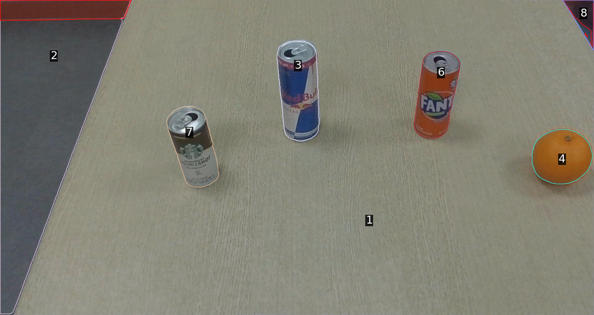
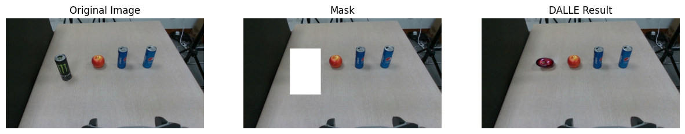

# SoM with Scene graph generation

The code is from [SoM](https://github.com/microsoft/SoM). Set-of-Mark Visual Prompting for GPT-4V. 
- The repository contains the minimal example to generate the scene graph via SeSAM+GPT4V on the tabletop settings. 
- This repository also contains image editing via DALL-E. 


### Install
```
# install SoM
git clone https://github.com/microsoft/SoM

# install Semantic-SAM
pip install git+https://github.com/UX-Decoder/Semantic-SAM.git@package

# copy ops file from SoM
cp -r SoM/ops ops

# install Deformable Convolution for Semantic-SAM
cd ops && sh make.sh && cd ..
```
Download your weights in ckpt folder from [SeSAM](https://github.com/UX-Decoder/Semantic-SAM) (SwinL)!


### Run the code
The code is in [scene.ipynb](./scene.ipynb) file


**Don't forget to put your OpenAI API key on the './key/key.txt' file**!


Please Edit the 2nd cell for your own key file path. 

**1. SoM with Semantic-SAM**



**2. Scene graph generation via GPT4V**

Objects of interset:
```
The can on the left has the ID number 7.
The can in the middle has the ID number 3.
The can on the right has the ID number 6.
The orange has the ID number 4.
```
Scene graph:
```
Node:

[7]
attribute: color (brown), size (small), brand_name (Starbucks)
[3]
attribute: color (blue), size (small), brand_name (Red Bull)
[6]
attribute: color (orange), size (small), brand_name (Fanta)
[4]
attribute: color (orange), size (small), shape (round)
Edge:

[7] is left of [3]
[7] is far left of [6]
[7] is left of [4]
[3] is right of [7]
[3] is left of [6]
[3] is far left of [4]
[6] is right of [7]
[6] is right of [3]
[6] is left of [4]
[4] is right of [7]
[4] is far right of [3]
[4] is right of [6]
```

**3. Image Agumentation via DALL-E**

Input: "A coke can on the table"


